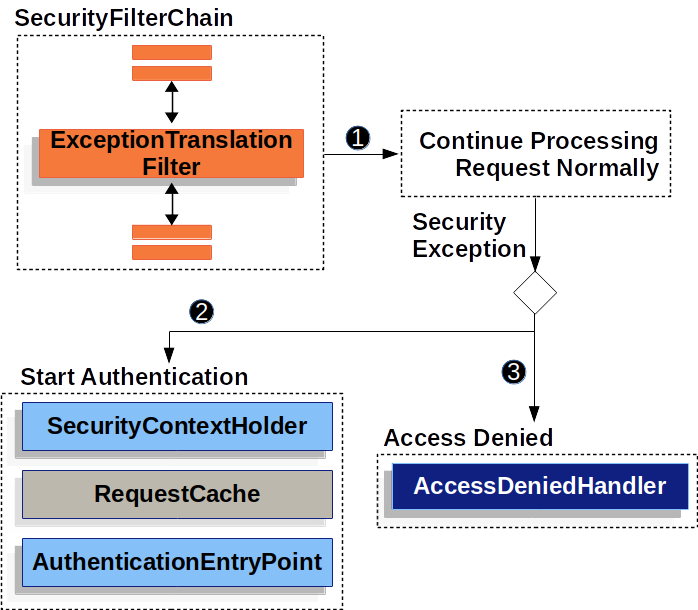

# Spring security sample

## 相关文章博客

[Spring Security 源码解读 ：基本架构及初始化](https://blog.csdn.net/weixin_41866717/article/details/128848734)

[深入理解 FilterChainProxy【源码篇】](https://wangsong.blog.csdn.net/article/details/107456398)

[深入理解 SecurityConfigurer 【源码篇】](https://wangsong.blog.csdn.net/article/details/107480688)

[深入理解 HttpSecurity【源码篇】](https://wangsong.blog.csdn.net/article/details/107509727)

[深入理解 WebSecurityConfigurerAdapter【源码篇】](https://wangsong.blog.csdn.net/article/details/107655180)

## 理解spring security中的原理

### spring-security的请求拦截早于DispatcherServlet

在spring-security中，请求一般会先经过`SecurityFilterProxy`的处理后，才会来到`DispatcherServlet`进行请求的servlet映射.
但此时可以做到：

- 防止下游的Filter实例或Servlet被调用。在这种情况下，Filter通常会写入`HttpServletResponse`。
- 修改下游的Filter实例和Servlet所使用的`HttpServletRequest`或`HttpServletResponse`。

### spring-security如何实现在IOC中管理Filter的生命周期

Spring Security对Servlet的支持是基于Servlet过滤器的，先看一下过滤器的一般作用。


Spring提供了一个名为`DelegatingFilterProxy`的Filter实现，允许在Servlet容器的生命周期和Spring的`ApplicationContext`之间建立桥梁。
Servlet容器允许通过使用自己的标准来注册Filter实例，但它不知道Spring定义的Bean。你可以通过标准的Servlet容器机制来注册`DelegatingFilterProxy`
，
但将所有的工作委托给实现了Filter的Spring Bean.

`DelegatingFilterProxy`从`ApplicationContext`查找Filter Bean，然后调用Filter Bean。
下面的列表显示了`DelegatingFilterProxy`的伪代码：

```java
public void doFilter(ServletRequest request,ServletResponse response,FilterChain chain){
		// Lazily get Filter that was registered as a Spring Bean
		// For the example in DelegatingFilterProxy delegate is an instance of Bean Filter0
		Filter delegate=getFilterBean(someBeanName);
		// delegate work to the Spring Bean
		delegate.doFilter(request,response);
		}
```

`DelegatingFilterProxy`的另一个好处是，它允许延迟查找Filter Bean实例。这一点很重要，因为在容器启动之前，容器需要注册Filter实例。
然而，Spring通常使用`ContextLoaderListener`来加载Spring Bean，这在需要注册Filter实例之后才会完成.

Spring Security的Servlet支持包含在`FilterChainProxy`中。`FilterChainProxy`是Spring
Security提供的一个特殊的Filter，允许通过`SecurityFilterChain`委托给许多Filter实例。
由于`FilterChainProxy`是一个Bean，它通常被包裹在`DelegatingFilterProxy`中。


SecurityFilterChain被FilterChainProxy用来确定当前请求应该调用哪些Spring安全过滤器实例。


`SecurityFilterChain`中的安全过滤器通常是Bean，但它们是用`FilterChainProxy`而不是`DelegatingFilterProxy`注册的。
与直接向Servlet容器或`DelegatingFilterProxy`注册相比，`FilterChainProxy`有很多优势。首先，它为Spring
Security的所有Servlet支持提供了一个起点。
由于这个原因，**_如果你试图对Spring Security的Servlet支持进行故障诊断，在`FilterChainProxy`
中添加一个调试点是一个很好的开始。_**

FilterChainProxy是Spring Security使用的核心，它可以执行一些不被视为可有可无的任务。
例如，它清除了`SecurityContext`以避免内存泄漏。它还应用Spring Security的HttpFirewall来保护应用程序免受某些类型的攻击。

此外，它在确定何时应该调用`SecurityFilterChain`方面提供了更多的灵活性。在Servlet容器中，Filter实例的调用仅基于URL。
然而，`FilterChainProxy`可以通过使用RequestMatcher接口，根据`HttpServletRequest`中的任何内容确定调用。

在多个`SecurityFilterChain`图中，`FilterChainProxy`决定应该使用哪个`SecurityFilterChain`。**_
只有第一个匹配的`SecurityFilterChain`被调用_**。

### 处理安全异常

`ExceptionTranslationFilter`允许将`AccessDeniedException`和`AuthenticationException`转换成HTTP响应。

ExceptionTranslationFilter作为安全过滤器之一被插入到FilterChainProxy中。


**注：`AuthenticationEntryPoint`用于向客户端请求凭证。例如，它可以重定向到一个登录页面或发送一个WWW-Authenticate头。**

首先，`ExceptionTranslationFilter`调用FilterChain.doFilter(request, response)来调用应用程序的其他部分。
如果用户没有被认证，或者是一个`AuthenticationException`，那么就开始认证。
`SecurityContextHolder`被清除掉。
`HttpServletRequest`被保存，这样一旦认证成功，它就可以用来重放原始请求。
如果它是一个`AccessDeniedException`，那么访问被拒绝。`AccessDeniedHandler`被调用来处理访问被拒绝。
如果应用程序没有抛出`AccessDeniedException`或`AuthenticationException`，那么`ExceptionTranslationFilter`就不会做任何事情.

*`ExceptionTranslationFilter`伪代码*

```java
try{
		filterChain.doFilter(request,response);
		}catch(AccessDeniedException|AuthenticationException ex){
		if(!authenticated||ex instanceof AuthenticationException){
		startAuthentication();
		}else{
		accessDenied();
		}
		}
```

**_正如在处理安全异常中所说明的，当一个请求没有认证，并且是针对一个需要认证的资源时，
需要保存认证资源的请求，以便在认证成功后重新请求。在Spring
Security中，这是通过使用`RequestCache`实现来保存`HttpServletRequest`的._**

### RequestCache

`HttpServletRequest`被保存在`RequestCache`中。当用户成功认证后，`RequestCache`被用来重放原始请求。
`RequestCacheAwareFilter`就是使用`RequestCache`来保存`HttpServletRequest`的。

默认情况下，使用一个`HttpSessionRequestCache`。
下面的代码演示了如何定制`RequestCache`
的实现，如果名为continue的参数存在，它将用于检查HttpSession是否有保存的请求。如果continue参数存在，RequestCache只检查已保存的请求.

```java
@Bean
DefaultSecurityFilterChain springSecurity(HttpSecurity http)throws Exception{
		HttpSessionRequestCache requestCache=new HttpSessionRequestCache();
		requestCache.setMatchingRequestParameterName("continue");
		http
		// ...
		.requestCache((cache)->cache
		.requestCache(requestCache)
		);
		return http.build();
		}
```

有很多原因，你可能想不在会话中存储用户的未经认证的请求。
你可能想把这种存储在用户的浏览器上卸载，或者把它存储在数据库中。
或者你可能想关闭这个功能，因为你总是想把用户重定向到主页，而不是他们登录前试图访问的页面。

要做到这一点，你可以使用NullRequestCache实现。

```java
@Bean
SecurityFilterChain springSecurity(HttpSecurity http)throws Exception{
		RequestCache nullRequestCache=new NullRequestCache();
		http
		// ...
		.requestCache((cache)->cache
		.requestCache(nullRequestCache)
		);
		return http.build();
		}
```

### spring-security默认的`/login`接口

- /login GET

  这个接口用于请求登录页面，生成页面的逻辑在DefaultLoginPageConfigurer中，生成页面后，会立即响应请求！
- /login POST

  这个请求用于spring-security的表单登录，最终被UsernamePasswordAuthenticationFilter进行拦截处理.

### 默认过滤器链和默认使用的过滤器

在spring security中，存在一条默认的过滤器链，当开发者未自定义过滤器链时，spring security会启用这条默认的过滤器链，
spring security中，存在一些默认使用的过滤器，在开发者自定义过滤器链时，这些过滤器会被自动加入到过滤器链中！

## 定制化spring-security

[弃用WebSecurityConfigurerAdapter](https://spring.io/blog/2022/02/21/spring-security-without-the-websecurityconfigureradapter)

### 自定义UserDetailsService

- jdbc身份认证

```java

@Configuration
public class SecurityConfiguration {

	@Bean
	public DataSource dataSource() {
		// 需要使用到数据源，此处使用嵌入式数据库H2
		return new EmbeddedDatabaseBuilder()
				.setType(EmbeddedDatabaseType.H2)
				.addScript(JdbcDaoImpl.DEFAULT_USER_SCHEMA_DDL_LOCATION)
				.build();
	}

	@Bean
	public UserDetailsManager users(DataSource dataSource) {
		UserDetails user = User.withDefaultPasswordEncoder()
							   .username("user")
							   .password("password")
							   .roles("USER")
							   .build();
		JdbcUserDetailsManager users = new JdbcUserDetailsManager(dataSource);
		users.createUser(user);
		return users;
	}
}
```

- 基于内存的身份认证

```java

@Configuration
public class SecurityConfiguration {
	@Bean
	public InMemoryUserDetailsManager userDetailsService() {
		UserDetails user = User.withDefaultPasswordEncoder()
							   .username("user")
							   .password("password")
							   .roles("USER")
							   .build();
		return new InMemoryUserDetailsManager(user);
	}
}
```

### 配置WebSecurity

推荐的做法是注册一个WebSecurityCustomizer 实例bean：

```java

@Configuration
public class SecurityConfiguration {

	@Bean
	public WebSecurityCustomizer webSecurityCustomizer() {
		return (web) -> web.ignoring().antMatchers("/ignore1", "/ignore2");
	}

}
```