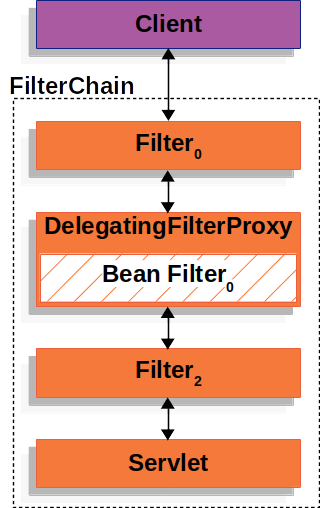

# Spring security sample

## 相关文章博客

[Spring Security 源码解读 ：基本架构及初始化](https://blog.csdn.net/weixin_41866717/article/details/128848734)

[深入理解 FilterChainProxy【源码篇】](https://wangsong.blog.csdn.net/article/details/107456398)

[深入理解 SecurityConfigurer 【源码篇】](https://wangsong.blog.csdn.net/article/details/107480688)

[深入理解 HttpSecurity【源码篇】](https://wangsong.blog.csdn.net/article/details/107509727)

[深入理解 WebSecurityConfigurerAdapter【源码篇】](https://wangsong.blog.csdn.net/article/details/107655180)

## 理解spring security中的原理

### spring-security的请求拦截早于DispatcherServlet

在spring-security中，请求一般会先经过`SecurityFilterProxy`的处理后，才会来到`DispatcherServlet`进行请求的servlet映射.
但此时可以做到：

- 防止下游的Filter实例或Servlet被调用。在这种情况下，Filter通常会写入`HttpServletResponse`。
- 修改下游的Filter实例和Servlet所使用的`HttpServletRequest`或`HttpServletResponse`。

### spring-security如何实现在IOC中管理Filter的生命周期

Spring Security对Servlet的支持是基于Servlet过滤器的，先看一下过滤器的一般作用。


Spring提供了一个名为`DelegatingFilterProxy`的Filter实现，允许在Servlet容器的生命周期和Spring的`ApplicationContext`之间建立桥梁。
Servlet容器允许通过使用自己的标准来注册Filter实例，但它不知道Spring定义的Bean。你可以通过标准的Servlet容器机制来注册`DelegatingFilterProxy`
，
但将所有的工作委托给实现了Filter的Spring Bean.



`DelegatingFilterProxy`从`ApplicationContext`查找Filter Bean，然后调用Filter Bean。
下面的列表显示了`DelegatingFilterProxy`的伪代码：

```java
public void doFilter(ServletRequest request,ServletResponse response,FilterChain chain){
		// Lazily get Filter that was registered as a Spring Bean
		// For the example in DelegatingFilterProxy delegate is an instance of Bean Filter0
		Filter delegate=getFilterBean(someBeanName);
		// delegate work to the Spring Bean
		delegate.doFilter(request,response);
		}
```

`DelegatingFilterProxy`的另一个好处是，它允许延迟查找Filter Bean实例。这一点很重要，因为在容器启动之前，容器需要注册Filter实例。
然而，Spring通常使用`ContextLoaderListener`来加载Spring Bean，这在需要注册Filter实例之后才会完成.

Spring Security的Servlet支持包含在`FilterChainProxy`中。`FilterChainProxy`是Spring
Security提供的一个特殊的Filter，允许通过`SecurityFilterChain`委托给许多Filter实例。
由于`FilterChainProxy`是一个Bean，它通常被包裹在`DelegatingFilterProxy`中。


SecurityFilterChain被FilterChainProxy用来确定当前请求应该调用哪些Spring安全过滤器实例。


`SecurityFilterChain`中的安全过滤器通常是Bean，但它们是用`FilterChainProxy`而不是`DelegatingFilterProxy`注册的。
与直接向Servlet容器或`DelegatingFilterProxy`注册相比，`FilterChainProxy`有很多优势。首先，它为Spring
Security的所有Servlet支持提供了一个起点。
由于这个原因，**_如果你试图对Spring Security的Servlet支持进行故障诊断，在`FilterChainProxy`
中添加一个调试点是一个很好的开始。_**

FilterChainProxy是Spring Security使用的核心，它可以执行一些不被视为可有可无的任务。
例如，它清除了`SecurityContext`以避免内存泄漏。它还应用Spring Security的HttpFirewall来保护应用程序免受某些类型的攻击。

此外，它在确定何时应该调用`SecurityFilterChain`方面提供了更多的灵活性。在Servlet容器中，Filter实例的调用仅基于URL。
然而，`FilterChainProxy`可以通过使用RequestMatcher接口，根据`HttpServletRequest`中的任何内容确定调用。

在多个`SecurityFilterChain`图中，`FilterChainProxy`决定应该使用哪个`SecurityFilterChain`。
**_只有第一个匹配的`SecurityFilterChain`被调用_**。

### 处理安全异常

`ExceptionTranslationFilter`允许将`AccessDeniedException`和`AuthenticationException`转换成HTTP响应。

ExceptionTranslationFilter作为安全过滤器之一被插入到FilterChainProxy中。


**注：`AuthenticationEntryPoint`用于向客户端请求凭证。例如，它可以重定向到一个登录页面或发送一个WWW-Authenticate头。**

首先，`ExceptionTranslationFilter`调用FilterChain.doFilter(request, response)来调用应用程序的其他部分。
如果用户没有被认证，或者是一个`AuthenticationException`，那么就开始认证。
`SecurityContextHolder`被清除掉。
`HttpServletRequest`被保存，这样一旦认证成功，它就可以用来重放原始请求。
如果它是一个`AccessDeniedException`，那么访问被拒绝。`AccessDeniedHandler`被调用来处理访问被拒绝。
如果应用程序没有抛出`AccessDeniedException`或`AuthenticationException`，那么`ExceptionTranslationFilter`就不会做任何事情.

*`ExceptionTranslationFilter`伪代码*

```java
try{
		filterChain.doFilter(request,response);
		}catch(AccessDeniedException|AuthenticationException ex){
		if(!authenticated||ex instanceof AuthenticationException){
		startAuthentication();
		}else{
		accessDenied();
		}
		}
```

**_正如在处理安全异常中所说明的，当一个请求没有认证，并且是针对一个需要认证的资源时，
需要保存认证资源的请求，以便在认证成功后重新请求。在Spring
Security中，这是通过使用`RequestCache`实现来保存`HttpServletRequest`的._**

### RequestCache

`HttpServletRequest`被保存在`RequestCache`中。当用户成功认证后，`RequestCache`被用来重放原始请求。
`RequestCacheAwareFilter`就是使用`RequestCache`来保存`HttpServletRequest`的。

默认情况下，使用一个`HttpSessionRequestCache`。
下面的代码演示了如何定制`RequestCache`
的实现，如果名为continue的参数存在，它将用于检查HttpSession是否有保存的请求。如果continue参数存在，RequestCache只检查已保存的请求.

```java
@Bean
DefaultSecurityFilterChain springSecurity(HttpSecurity http)throws Exception{
		HttpSessionRequestCache requestCache=new HttpSessionRequestCache();
		requestCache.setMatchingRequestParameterName("continue");
		http
		// ...
		.requestCache((cache)->cache
		.requestCache(requestCache)
		);
		return http.build();
		}
```

有很多原因，你可能想不在会话中存储用户的未经认证的请求。
你可能想把这种存储在用户的浏览器上卸载，或者把它存储在数据库中。
或者你可能想关闭这个功能，因为你总是想把用户重定向到主页，而不是他们登录前试图访问的页面。

要做到这一点，你可以使用NullRequestCache实现。

```java
@Bean
SecurityFilterChain springSecurity(HttpSecurity http)throws Exception{
		RequestCache nullRequestCache=new NullRequestCache();
		http
		// ...
		.requestCache((cache)->cache
		.requestCache(nullRequestCache)
		);
		return http.build();
		}
```

### AbstractAuthenticationProcessingFilter

`AbstractAuthenticationProcessingFilter`被用作验证用户凭证的基础过滤器。
在认证凭证之前，Spring Security通常通过使用`AuthenticationEntryPoint`来请求凭证。
接下来，`AbstractAuthenticationProcessingFilter`可以对提交给它的任何认证请求进行认证。


1. 当用户提交他们的证书时，`AbstractAuthenticationProcessingFilter`会从`HttpServletRequest`
   中创建一个要认证的`Authentication`。
   创建的认证的类型取决于`AbstractAuthenticationProcessingFilter`的子类。
   例如，`UsernamePasswordAuthenticationFilter`从`HttpServletRequest`
   中提交的用户名和密码创建一个`UsernamePasswordAuthenticationToken`。
2. 接下来，Authentication被传入`AuthenticationManager`，以进行认证。
3. 如果认证失败，则为失败。

- `SecurityContextHolder`被清除掉。
- `RememberMeServices.loginFail`被调用。如果没有配置remember me，这将是一个无用功。请参阅rememberme软件包。
- `AuthenticationFailureHandler`被调用。参见`AuthenticationFailureHandler`接口。

4. 如果认证成功，则为成功。

- `SessionAuthenticationStrategy`被通知有新的登录。参见`SessionAuthenticationStrategy`接口。
- 认证被设置在 `SecurityContextHolder` 上。后来，`SecurityContextPersistenceFilter`将`SecurityContext`保存到HttpSession中。请参阅
  `SecurityContextPersistenceFilter `类。
- `RememberMeServices.loginSuccess`被调用。如果没有配置remember me，这个操作跳过。
- `ApplicationEventPublisher`发布了一个`InteractiveAuthenticationSuccessEvent`。
- `AuthenticationSuccessHandler`被调用。参见`AuthenticationSuccessHandler`接口。

### Form Login

Spring Security提供了对通过HTML表单提供用户名和密码的支持。接下来将详细介绍基于表单的认证在Spring Security中如何工作。
本段研究了基于表单的登录在Spring Security中是如何工作的。首先，我们看到用户是如何被重定向到登录表单的：


上面的图建立在SecurityFilterChain的流程上。

1. 首先，一个用户向其未被授权的资源（/private）发出一个未经认证的请求。
2. Spring Security的`FilterSecurityInterceptor`通过抛出一个`AccessDeniedException`来表明未经认证的请求被拒绝了。
3. 由于用户没有被认证，`ExceptionTranslationFilter`启动了开始认证，并通过配置的`AuthenticationEntryPoint`发送一个重定向到登录页面。
   在大多数情况下，`AuthenticationEntryPoint是LoginUrlAuthenticationEntryPoint`的一个实例。
4. 浏览器请求进入它被重定向的登录页面。
5. 应用程序中的某些东西，必须呈现登录页面。

当用户名和密码被提交后，`UsernamePasswordAuthenticationFilter`会对用户名和密码进行认证。
`UsernamePasswordAuthenticationFilter`扩展了`AbstractAuthenticationProcessingFilter`，所以下面的图看起来应该很相似：


上面的图建立在SecurityFilterChain的流程上。

1. 当用户提交他们的用户名和密码时，`UsernamePasswordAuthenticationFilter`通过从`HttpServletRequest`实例中提取用户名和密码，
   创建一个`UsernamePasswordAuthenticationToken`，这是一种认证类型。
2. 接下来，`UsernamePasswordAuthenticationToken`被传入`AuthenticationManager`实例，以进行认证。`AuthenticationManager`
   的细节取决于用户信息的存储方式。
3. 如果认证失败，进入失败处理流程:

- `SecurityContextHolder`被清除掉了。
- `RememberMeServices.loginFail`被调用。如果没有配置remember me，这个操作跳过。参见`RememberMeServices`接口。
- `AuthenticationFailureHandler`被调用。参见`AuthenticationFailureHandler`类。

4. 如果认证成功，进入认证成功处理流程：

- `SessionAuthenticationStrategy`被通知有新的登录。参见`SessionAuthenticationStrategy`接口。
- 认证是在 `SecurityContextHolder` 上设置的。请参阅 Javadoc 中的 `SecurityContextPersistenceFilter` 类。
- `RememberMeServices.loginSuccess`被调用。如果没有配置remember me，这个操作跳过。参见`RememberMeServices`接口。
- `ApplicationEventPublisher`发布了一个`InteractiveAuthenticationSuccessEvent`。
- `AuthenticationSuccessHandler`被调用。通常，这是一个`SimpleUrlAuthenticationSuccessHandler`
  ，当我们重定向到登录页面时，它会重定向到由`ExceptionTranslationFilter`保存的请求。

默认情况下，Spring Security表单登录被启用。然而，只要提供任何基于Servlet的配置，就必须明确提供基于表单的登录。下面的例子显示了一个最小的、明确的Java配置：

```java
public SecurityFilterChain filterChain(HttpSecurity http){
		http
		.formLogin(withDefaults());
		// ...
		}
```

在前面的配置中，Spring Security渲染了一个默认的登录页面。大多数生产应用需要一个自定义的登录表单。
下面的配置演示了如何提供一个自定义的登录表单：

```java
public SecurityFilterChain filterChain(HttpSecurity http){
		http
		.formLogin(form->form
		.loginPage("/login")
		.permitAll()
		);
		// ...
		}
```

当登录页面在Spring Security配置中被指定时，你要负责渲染该页面。
下面的Thymeleaf模板产生一个符合/login.的登录页面的HTML登录表单：

```xml
<!DOCTYPE html>
<html xmlns="http://www.w3.org/1999/xhtml" xmlns:th="https://www.thymeleaf.org">
    <head>
        <title>Please Log In</title>
    </head>
    <body>
        <h1>Please Log In</h1>
        <div th:if="${param.error}">
            Invalid username and password.
        </div>
        <div th:if="${param.logout}">
            You have been logged out.
        </div>
        <form th:action="@{/login}" method="post">
            <div>
                <input type="text" name="username" placeholder="Username"/>
            </div>
            <div>
                <input type="password" name="password" placeholder="Password"/>
            </div>
            <input type="submit" value="Log in"/>
        </form>
    </body>
</html>
```

如果你使用Spring MVC，你需要一个控制器，将GET /login映射到我们创建的登录模板。
下面的例子展示了一个最小的LoginController：

```java

@Controller
public class LoginController {
	@GetMapping("/login")
	public String login() {
		return "login";
	}
}
```

### spring-security默认的`/login`接口

- /login GET

  这个接口用于请求登录页面，生成页面的逻辑在`DefaultLoginPageConfigurer`中，生成页面后，会立即响应请求！
- /login POST

  这个请求用于spring-security的表单登录，最终被`UsernamePasswordAuthenticationFilter`进行拦截处理.

### DaoAuthenticationProvider

DaoAuthenticationProvider是一个AuthenticationProvider的实现，它使用UserDetailsService和PasswordEncoder来验证一个用户名和密码。


1. 读取用户名和密码部分的认证Filter将UsernamePasswordAuthenticationToken传递给AuthenticationManager，它由ProviderManager实现。
2. ProviderManager被配置为使用一个DaoAuthenticationProvider类型的AuthenticationProvider。
3. DaoAuthenticationProvider从UserDetailsService中查找UserDetails。
4. DaoAuthenticationProvider使用PasswordEncoder来验证上一步返回的UserDetails上的密码。
5. 当认证成功时，返回的认证是UsernamePasswordAuthenticationToken类型的，并且有一个委托人是由配置的UserDetailsService返回的UserDetails。
   最终，返回的UsernamePasswordAuthenticationToken被认证过滤器设置在SecurityContextHolder上。

### 默认过滤器链和默认使用的过滤器

在spring security中，存在一条默认的过滤器链，当开发者未自定义过滤器链时，spring security会启用这条默认的过滤器链，
spring security中，存在一些默认使用的过滤器，在开发者自定义过滤器链时，这些过滤器会被自动加入到过滤器链中！

## 定制化spring-security

[弃用WebSecurityConfigurerAdapter](https://spring.io/blog/2022/02/21/spring-security-without-the-websecurityconfigureradapter)

### 自定义UserDetailsService

- jdbc身份认证

```java

@Configuration
public class SecurityConfiguration {

	@Bean
	public DataSource dataSource() {
		// 需要使用到数据源，此处使用嵌入式数据库H2
		return new EmbeddedDatabaseBuilder()
				.setType(EmbeddedDatabaseType.H2)
				.addScript(JdbcDaoImpl.DEFAULT_USER_SCHEMA_DDL_LOCATION)
				.build();
	}

	@Bean
	public UserDetailsManager users(DataSource dataSource) {
		UserDetails user = User.withDefaultPasswordEncoder()
							   .username("user")
							   .password("password")
							   .roles("USER")
							   .build();
		JdbcUserDetailsManager users = new JdbcUserDetailsManager(dataSource);
		users.createUser(user);
		return users;
	}
}
```

- 基于内存的身份认证

```java

@Configuration
public class SecurityConfiguration {
	@Bean
	public InMemoryUserDetailsManager userDetailsService() {
		UserDetails user = User.withDefaultPasswordEncoder()
							   .username("user")
							   .password("password")
							   .roles("USER")
							   .build();
		return new InMemoryUserDetailsManager(user);
	}
}
```

- 自定义`UserDetailsService`的实现
  例如，假设`CustomUserDetailsService`实现了`UserDetailsService`，下面的列表就可以自定义认证：

```java

@Configuration
public class SecurityConfiguration {
	@Bean
	CustomUserDetailsService customUserDetailsService() {
		return new CustomUserDetailsService();
	}
}
```

**_注：只有在`AuthenticationManagerBuilder`没有被填充并且没有定义`AuthenticationProvider`Bean的情况下才会使用。_**

### 配置WebSecurity

推荐的做法是注册一个`WebSecurityCustomizer` 实例bean：

```java

@Configuration
public class SecurityConfiguration {

	@Bean
	public WebSecurityCustomizer webSecurityCustomizer() {
		return (web) -> web.ignoring().antMatchers("/ignore1", "/ignore2");
	}

}
```